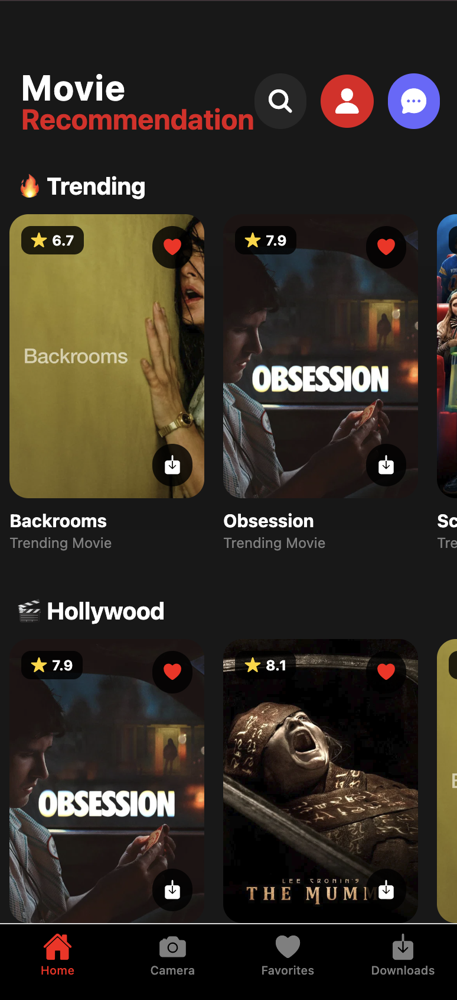
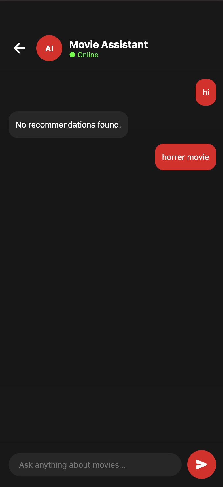
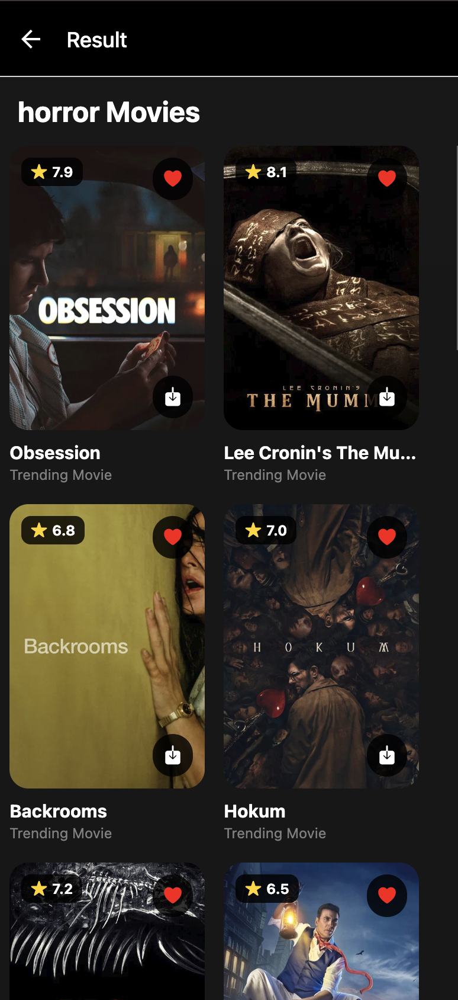
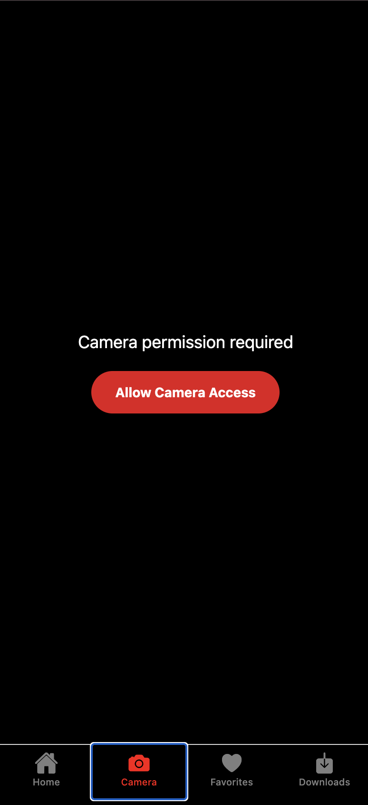
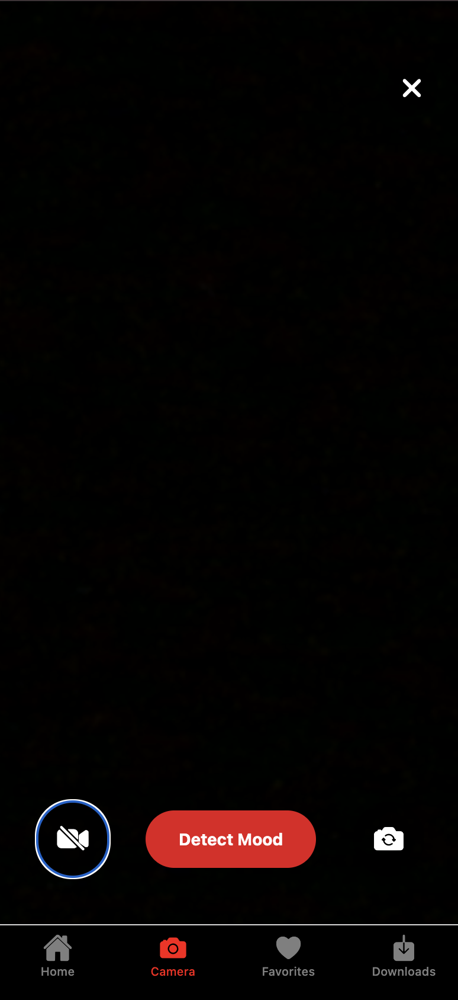
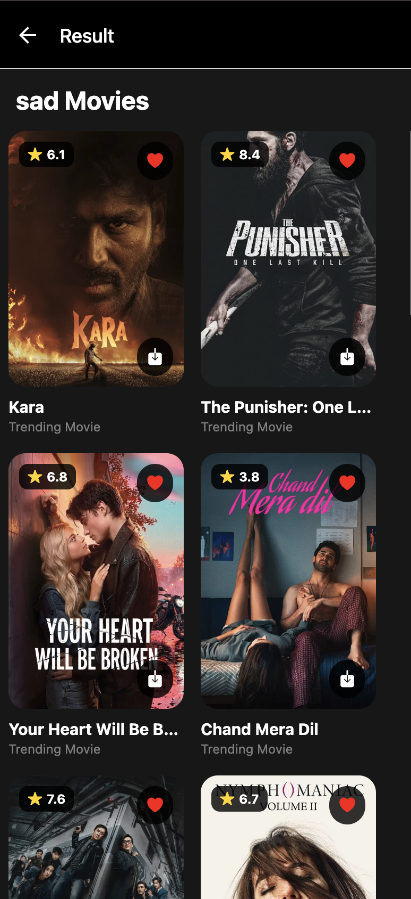
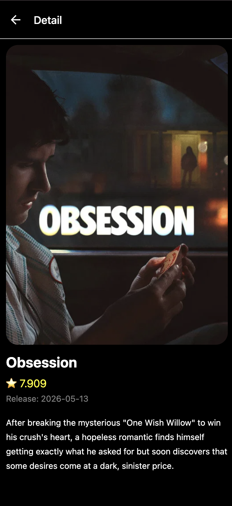
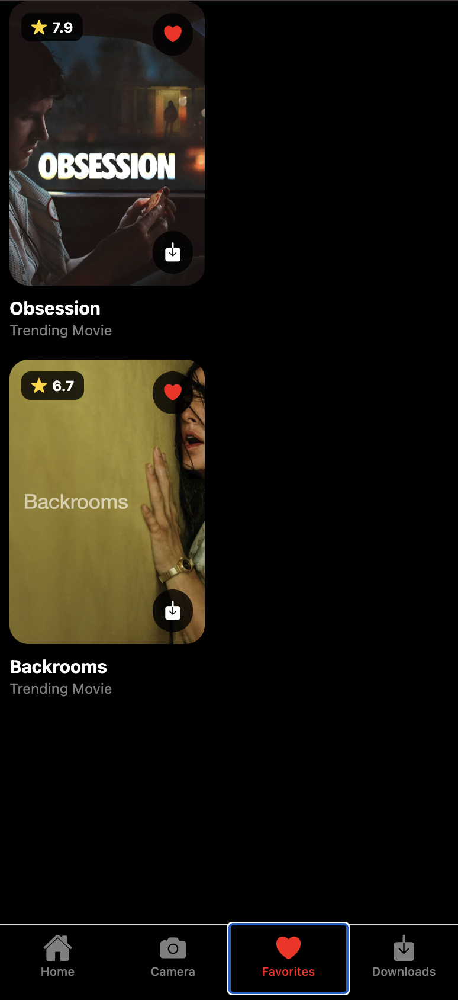
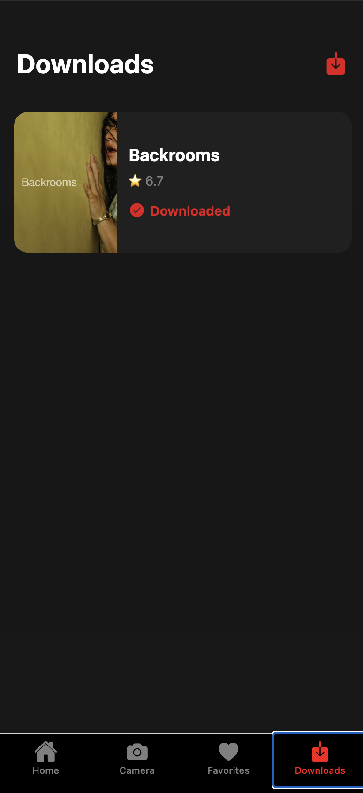

# 🎬 Movie AI - Mood Based Movie Recommendation App

A React Native application that recommends movies based on the user's detected mood. The application uses the device camera to capture an image, determines a mood category, and then fetches relevant movie recommendations using The Movie Database (TMDB) API.

---

# 📱 Features

* Camera Integration
* Mood Detection
* Movie Recommendations
* Trending Movies
* Movie Search
* Responsive UI
* React Navigation
* TMDB API Integration
* Real-Time Movie Fetching
* Genre-Based Recommendations

---

# 🚀 Tech Stack

## Frontend

* React Native
* Expo
* JavaScript

## Navigation

* React Navigation
* Native Stack Navigation
* Bottom Tab Navigation

## APIs

* TMDB API

## Libraries

* Expo Camera
* Axios
* React Native Reanimated
* React Native Gesture Handler
* React Native Screens
* React Native Safe Area Context
* Firebase

---

# 📂 Project Structure

```bash
movie-ai/
│
├── assets/
│
├── components/
│   ├── MovieCard.js
│
├── config/
│   ├── apiconfig.js
│
├── navigation/
│   ├── AppNavigator.js
│
├── screens/
│   ├── HomeScreen.js
│   ├── CameraScreen.js
│   ├── ResultScreen.js
│   ├── SearchScreen.js
│
├── services/
│   ├── api.js
│
├── utils/
│   ├── constant.js
│
├── App.js
│
└── package.json
```

---

# 🎯 Application Workflow

```text
User Opens App
        │
        ▼
Home Screen
        │
        ▼
Open Camera
        │
        ▼
Capture Image
        │
        ▼
Mood Detection
        │
        ▼
Mood Generated
(Happy / Sad / Angry / Neutral)
        │
        ▼
Genre Mapping
        │
        ▼
TMDB API Request
        │
        ▼
Movie Recommendations
        │
        ▼
Result Screen
```

---

# 🎭 Mood Mapping Logic

| Mood    | Genre   |
| ------- | ------- |
| Happy   | Comedy  |
| Sad     | Drama   |
| Angry   | Action  |
| Neutral | Romance |

```javascript
export const moodGenres = {
  happy: 35,
  sad: 18,
  angry: 28,
  neutral: 10749,
};
```

---


# 📸 Screenshots

## Login Screen


## Register Screen


## Home Screen


## AI Chat Screen


## AI Result Screen


## Camera Feature


## Camera Feature Result


## Camera Result


## Movie Details Screen


## Favorites Screen


## Downloads Screen


## Logout Profile Screen


---

# 🔥 Camera Implementation

The application uses Expo Camera to access the device camera.

```javascript
import {
  CameraView,
  useCameraPermissions,
} from "expo-camera";
```

### Features

* Camera Permission Handling
* Front Camera
* Back Camera
* Camera Toggle
* Capture Image
* Camera ON/OFF

---

# 🎬 TMDB Integration

Movies are fetched using The Movie Database API.

### Endpoint

```text
https://api.themoviedb.org/3/discover/movie
```

### Genre Example

```javascript
const response =
await axios.get(
`${BASE_URL}/discover/movie?api_key=${API_KEY}&with_genres=${genreId}`
);
```

---

# 🔍 Search Feature

Users can search movies manually.

### Endpoint

```text
/search/movie
```

### Function

```javascript
export const searchMovies =
async (query) => {
  const response =
  await axios.get(
    `${BASE_URL}/search/movie?api_key=${API_KEY}&query=${query}`
  );

  return response.data.results;
};
```

---

# 🎞 Trending Movies

Weekly trending movies are fetched from TMDB.

```javascript
/trending/movie/week
```

---

# ⚙ Environment Setup

## Clone Repository

```bash
git clone https://github.com/yourusername/movie-ai.git
```

---

## Move Into Project

```bash
cd movie-ai
```

---

## Install Dependencies

```bash
npm install
```

---

## Start Development Server

```bash
npx expo start
```

---

# 📦 Dependencies

```json
{
  "@expo/vector-icons": "^15.0.3",
  "@react-navigation/native": "^7.2.4",
  "@react-navigation/native-stack": "^7.14.14",
  "@react-navigation/bottom-tabs": "^7.15.13",
  "axios": "^1.16.0",
  "expo": "~54.0.33",
  "expo-camera": "~17.0.10",
  "expo-face-detector": "^13.0.2",
  "expo-file-system": "~19.0.22",
  "firebase": "^12.13.0",
  "react": "19.1.0",
  "react-native": "0.81.5"
}
```

---

# 🧠 Future Enhancements

* Real AI Mood Detection
* Face Expression Analysis
* TensorFlow Lite Integration
* ML Kit Integration
* User Authentication
* Favorite Movies
* Watchlist
* Movie Details Page
* Trailer Support
* Dark/Light Theme
* Movie Reviews
* Personalized Recommendations

---

# 🛡 Error Handling

* Camera Permission Validation
* API Error Handling
* Network Failure Handling
* Empty Results Handling
* Invalid Mood Handling

---

# 📊 Key Concepts Used

* React Hooks
* useState
* useEffect
* useRef
* Async/Await
* REST APIs
* Navigation
* Camera APIs
* Conditional Rendering
* FlatList Rendering

---

# 👨‍💻 Author

Ayushmaan Yadav

React Native Developer

---

# ⭐ Conclusion

Movie AI is a React Native application that combines camera functionality, mood categorization, and movie recommendation systems to create an engaging user experience. The project demonstrates practical implementation of React Native, Expo Camera, API Integration, Navigation, State Management, and Dynamic UI Rendering.

```
```
